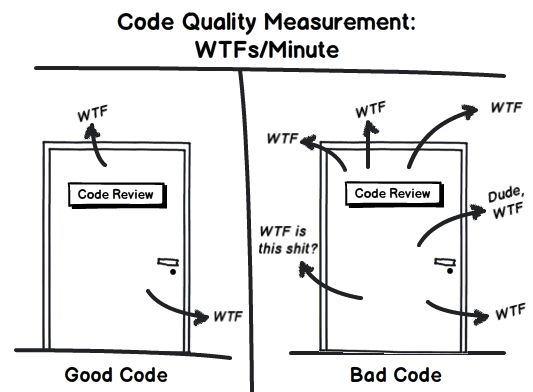

# Qualidade de software
Antes mesmo de começar a falar sobre Testes, precisamos voltar um pouco e falar sobre Qualidade de Software. A nossa preocupação por ter um sistema de qualidade, que nos fez pensar em métodos para garantir isso e daí nasceram os testes!

## Qualidade para o cliente

Para um cliente, ele quer que tudo esteja funcionando, que seja bonito e o principal, que ele não gaste muito com isso. O medidor de qualidade para o cliente é quando ele faz uma cara mais ou menos assim:

## Qualidade para o chefe

Já para o seu chefe/empresa, qualidade é quando você faz as coisas sem demorar muito ou ter que refazer. Quando ele consegue gerar lucros e o cliente está feliz. Uma imagem que demonstra muito bem o que importa (qualidade) para o seu chefe é:

## Qualidade para o desenvolvedor

Nós desenvolvedores, obviamente vamos ver qualidade no código. Quanto mais fácil de ler e 
entender o código, mais qualidade ele tem para nós. Assim como ter uma boa documentação. Segue abaixo uma imagem que descreve bastante reações a códigos bons e ruins:

### Operação

- `Corretitude`Ele faz o que é pedido?
- `Confiabilidade` - Ele é preciso?
- `Eficiência` - Ele tem boa performance?
- `Integridade` - Oferece segurança?
- `Usabilidade` - Fácil de usar?
- `Adaptabilidade` - Ele se adapta as necessidades do usuário?

### Transição

- `Portabilidade` - Consigo movê-lo facilmente?
- `Reusabilidade` - Posso utilizar parte dele?
- `Interoperabilidade` - Ele trabalha com outros softwares em conjunto?

### Revisão

- `Manutenibilidade` - Fácil de corrigir?
- `Flexibilidade` - Fácil de mudar?
- `Testabilidade` - Posso testar seu funcionamento?